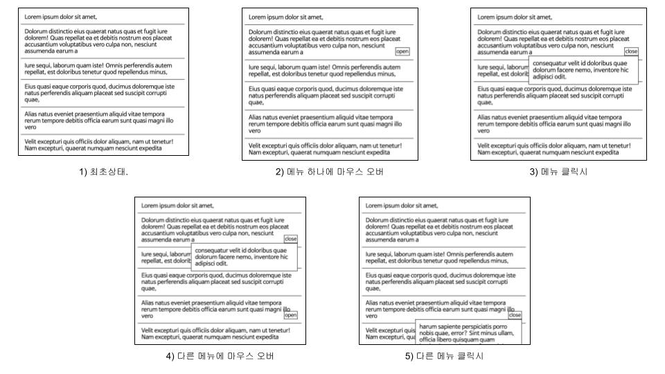

## Case1 : Context Menu

### 케이스 주제
Q. 버튼을 클릭하면 컨텍스트 메뉴가 나타나고, 메뉴를 선택하거나 그 외의 부분을 클릭하면 사라지는 팝오버 컴포넌트를 구현하세요

### 기능 요구사항
1. 임의의 메뉴 목록에 대하여 각 메뉴를 클릭하면 해당 메뉴에 관련된 문구가 떠있는 형태(팝오버)로 나타난다.
2. 팝오버 상태에서 해당 문구를 클릭하면 해당 메뉴가 사라진다.
3. 팝오버 상태에서 다른 메뉴를 클릭하면 해당 메뉴의 팝오버가 나타난다. 이 때 기존의 팝오버는 사라진다.

### 기능 작동 이미지

### 문제
Q1. 문제 상황에 대하여 Java Script로 동작을 구현시킬 수 있는 코드를 작성해보세요 [`Note 보기`](https://github.com/mirae611/TIL/tree/main/Front-end/Front-end%20Project/case1_context-menu/question/q1_js#q1---1-%EC%9E%90%EB%B0%94%EC%8A%A4%ED%81%AC%EB%A6%BD%ED%8A%B8-1)  
Q2. 문제 상황에 대하여 jquery로 동작을 구현시킬 수 있는 코드를 작성해보세요

Q3. 문제 상황에 대하여 HTML(detail 태그)로 동작을 구현시킬 수 있는 코드를 작성해보세요

Q4. 문제 상황에 대하여 React로 동작을 구현시킬 수 있는 코드를 작성해보세요

Q5. 문제 상황에 대하여 React-CreatePortal 기능으로 동작을 구현시킬 수 있는 코드를 작성해보세요

### 주요 학습 키워드
- 이벤트 리스너, 이벤트 위임 구현 원리, detail 태그, React-Create Portal 등

### 작성해주셔야 하는 question 파일경로
**Q1**
`./question/q1_js/index.js`
`./question/q1_js/style.css`

**Q2**
`./question/q2_jquery/index.js`
`./question/q2_jquery/style.css`

**Q3**
`./question/q3_html-js/index.js`
`./question/q3_html-js/style.css`

**Q4**
`./question/q4_react.js/src/App.js`

**Q5**
`./question/q5_react.js-createportal/src/App.js`
